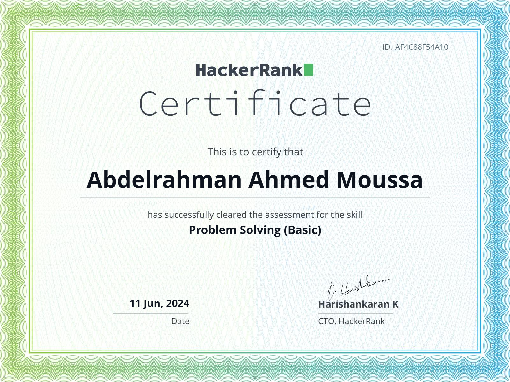

<h1>
    
</h1>

📝 ***Feel free to contact me. I am always here ...***   
 

      

## About me

Hi, I'm Abdelrahman Ahmed Moussa, a passionate self-taught Embedded SW Engineer.

## 🔓 Repositories

<table style="width:100%;">
  <caption><b> Embedded Systems Projects </b></caption>
  <colgroup>
    <col span="1" style="width:25%;">
  </colgroup>
  <thead>
    <tr style="border-bottom: 1.5px solid black; background-color: rgba(0, 204, 204, 0.3);">
      <th>🎁 Projects</th>
      <th>⭐ Stars</th>
      <th>📚 Forks</th>
      <th>🛎 Issues</th>
      <th>📬 Pull requests</th>
    </tr>

  </thead>
  <tbody>
     <tr style="border-bottom: 1.5px solid black;">
      <td><a href="https://github.com/abd-elarhman/Microwave-Oven" style="display:block; text-decoration:none;"><b>Microwave-Oven</b></a></td>
      <td></td>
      <td></td>
      <td></td>
      <td></td>
    </tr>
  </tbody>
</table>

<table style="width:100%;">
    <caption><b> Microcontrollers Drivers </b></caption>
  <colgroup>
    <col span="1" style="width:25%;">
  </colgroup>
  <thead>
  <thead>
    <tr style="border-bottom: 1.5px solid black; background-color: rgba(0, 204, 204, 0.3);">
      <th>🎁 Microcontroller</td>
      <th>⭐ Stars</td>
      <th>📚 Forks</td>
      <th>🛎 Issues</td>
      <th>📬 Pull requests</td>
    </tr>
  </thead>
  <tbody>
    <tr style="border-bottom: 1.5px solid black;">
      <td><a href="https://github.com/abd-elarhman/Atmega32-Drivers" style="display:block; text-decoration:none;"><b>AVR</b></a></td>
        <td></td>
      <td></td>
      <td></td>
      <td></td>
      </tr>
  </tbody>
  <tbody>
    <tr style="border-bottom: 1.5px solid black;">
      <td><a href="https://github.com/abd-elarhman/Arm-Cortex-M3" style="display:block; text-decoration:none;"><b>ARM</b></a></td>
        <td></td>
      <td></td>
      <td></td>
      <td></td>
      </tr>
  </tbody>
</table>

<table style="width:100%;">
    <colgroup>
    <col span="1" style="width:25%;">
  </colgroup>
  <thead>
  <thead>
    <caption><b> Others </b></caption>
    <colgroup>
    <col span="1" style="width:25%;">
  </colgroup>
  <thead>
  <thead>
        <tr style="border-bottom: 1.5px solid black; background-color: rgba(0, 204, 204, 0.3);">
            <th>🎁 Category</th>
            <th>⭐ Stars</th>
            <th>📚 Forks</th>
            <th>🛎 Issues</th>
            <th>📬 Pull requests</th>
        </tr>
    </thead>
    <tbody>
	    <tr style="border-bottom: 1.5px solid black;">
        <td><a href="https://github.com/abd-elarhman/HackerRank" style="display:block; text-decoration:none;"><b>HackerRank-Solutions</b></a></td>
        <td></td>
        <td></td>
        <td></td>
        <td></td>
        </tr>
  </tbody>
</table>

## 🛠️ Tools

  

## 🏆 Certifications

  

  <b>HackerRank Problem Solving (Basic)</b> 
  Awarded for demonstrating essential problem-solving skills in C programming. 
  <b>Issued</b>: [June, 2024] | <b>Credential ID</b>: [Af4C88F54A10]

## 📈 My Contributions  

## Contact me

    
    
    

- 💬 ask me about anything, i am happy to help 

 
