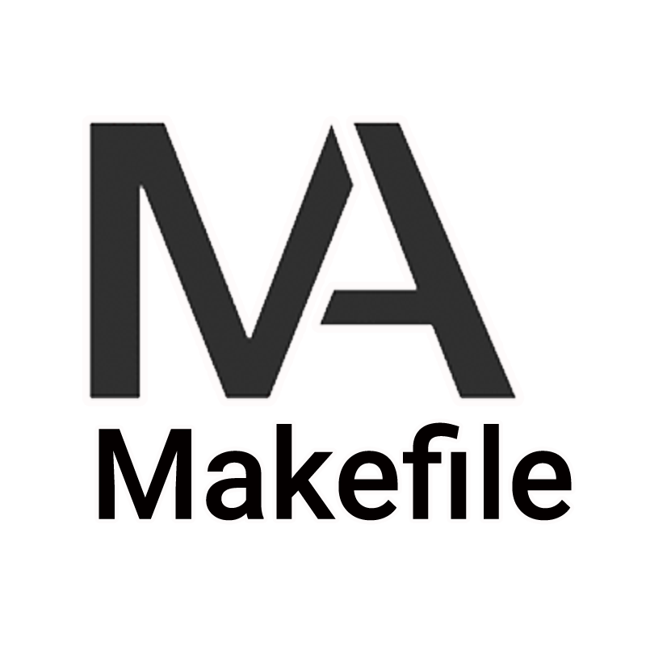
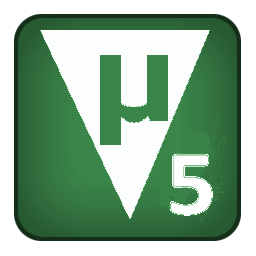
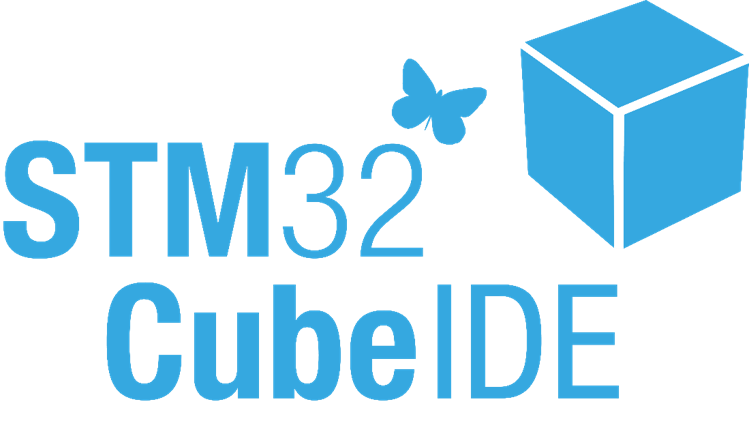
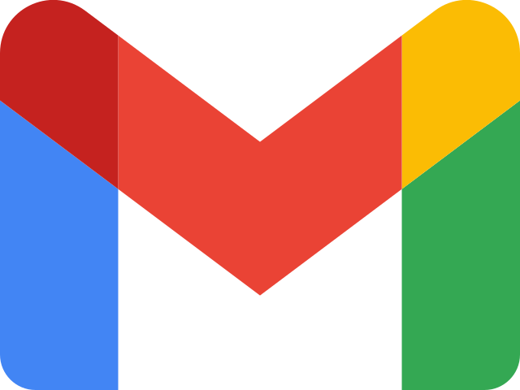

<h1>
    
</h1>

📝 ***Feel free to contact me. I am always here ...***   
 

      

## About me

Hi, I'm Abdelrahman Ahmed Moussa, a passionate self-taught Embedded SW Engineer.

## 🔓 Projects

<table style="width:100%;">
  <caption><b> Embedded Projects </b></caption>
  <colgroup>
    <col span="1" style="width:25%;">
  </colgroup>
  <thead>
    <tr style="border-bottom: 1.5px solid black; background-color: rgba(0, 204, 204, 0.3);">
      <th>🎁 Projects</th>
      <th>⭐ Stars</th>
      <th>📚 Forks</th>
      <th>🛎 Issues</th>
      <th>📬 Pull requests</th>
    </tr>
  </thead>
  <tbody>
    
  </tbody>
</table>

<table style="width:100%;">
    <caption><b> Microcontrollers Drivers </b></caption>
  <colgroup>
    <col span="1" style="width:25%;">
  </colgroup>
  <thead>
  <thead>
    <tr style="border-bottom: 1.5px solid black; background-color: rgba(0, 204, 204, 0.3);">
      <th>🎁 Microcontroller</td>
      <th>⭐ Stars</td>
      <th>📚 Forks</td>
      <th>🛎 Issues</td>
      <th>📬 Pull requests</td>
    </tr>
  </thead>
  <tbody>
    <tr style="border-bottom: 1.5px solid black;">
      <td><a href="" style="display:block; text-decoration:none;"><b>ARM</b></a></td>
    </tr>
    <tr style="border-bottom: 1.5px solid black;">
      <td><a href="" style="display:block; text-decoration:none;"><b>AVR</b></a></td>
      </tr>
  </tbody>
</table>

<table style="width:100%;">
  <caption><b> C Projects </b></caption>
  <colgroup>
    <col span="1" style="width:25%;">
  </colgroup>
  <thead>
  <thead>
    <tr style="border-bottom: 1.5px solid black; background-color: rgba(0, 204, 204, 0.3);">
      <th>🎁 Projects</th>
      <th>⭐ Stars</th>
      <th>📚 Forks</th>
      <th>🛎 Issues</th>
      <th>📬 Pull requests</th>
    </tr>
  </thead>
  <tbody>
    <tr style="border-bottom: 1.5px solid black;">
      <td><a href="" style="display:block; text-decoration:none;"><b>C Labs</b></a></td>
    </tr>
  </tbody>
</table>

<table style="width:100%;">
    <colgroup>
    <col span="1" style="width:25%;">
  </colgroup>
  <thead>
  <thead>
    <caption><b> Others </b></caption>
    <colgroup>
    <col span="1" style="width:25%;">
  </colgroup>
  <thead>
  <thead>
        <tr style="border-bottom: 1.5px solid black; background-color: rgba(0, 204, 204, 0.3);">
            <th>🎁 Category</th>
            <th>⭐ Stars</th>
            <th>📚 Forks</th>
            <th>🛎 Issues</th>
            <th>📬 Pull requests</th>
        </tr>
    </thead>
    <tbody>
        <tr style="border-bottom: 1.5px solid black;">
        <td><a href="" style="display:block;   text-decoration:none;"><b> Problem-Solving </b></a></td>
    </tr>
  </tbody>
</table>

## 🌍 Languages

<code>
    
    
    
    
    
    
    
</code>

## 🛠️ Tools

<code>
    
    
    
    
    
    
    
    
    
</code>

## 📈 My Contributions  

## Contact me

    
    
    

- 💬 ask me about anything, i am happy to help 

 
